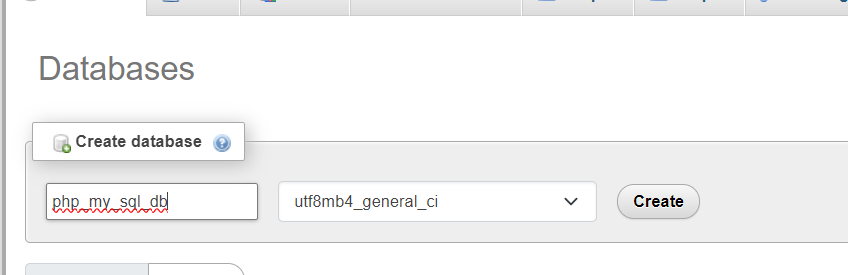
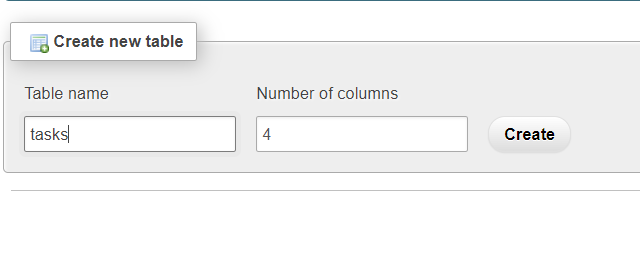
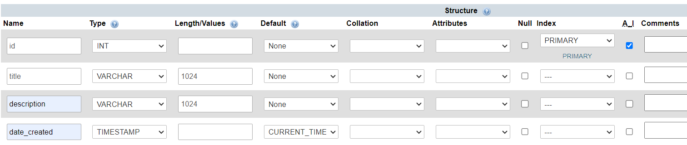

# Working with PHP and MySQL

For this section we're going to learn how to integrate PHP with MySQL for us to create CRUD (Create, Read, Update, Delete) Applications, but let's first focus on some concepts we need to learn before proceeding to the more advanced parts.


### Sessions in PHP
A session variable is a type of variable that allows data to be stored and accessed across multiple pages of a website during a user's visit. To learn how session variables work, create the given files below. 

We first create our ```index.php``` file. The main purpose of ```session_start()``` is to establish a connection to the existing session. ```session_unset()``` is for deleting all the session variables.

```php
<!DOCTYPE html>
<html lang="en">
<head>
	<meta charset="UTF-8">
	<meta name="viewport" content="width=device-width, initial-scale=1.0">
	<title>Document</title>
</head>
<body>
	<?php session_start(); ?>

	<h1>Fill in the input fields below</h1>
	
	<h2>
		User logged in:
		<?php
		if(isset($_SESSION['firstName'])) {
			echo $_SESSION['firstName'];
		}
		?>		
	</h2>

	<h2>
		User password:
		<?php
		if(isset($_SESSION['password'])) {
			echo $_SESSION['password'];
		}
		?>		
	</h2>
	<a href="unset.php">Logout</a>

	<form action="handleForm.php" method="POST">
		<p><input type="text" placeholder="First name here" name="firstName"></p>
		<p><input type="password" placeholder="Password here" name="password"></p>
		<p><input type="submit" value="Submit" name="submitBtn"></p>
	</form>
</body>
</html>
```

Let's create ```handleForm.php``` file

```php
<?php 

session_start();

// Check if submitBtn exists
if(isset($_POST['submitBtn'])) {

	// Get the first name from index.php
	$firstName = $_POST['firstName'];

	// Get the password from the input field
	$password = md5($_POST['password']);

	// Set the session variables
	$_SESSION['firstName'] = $firstName;
	$_SESSION['password'] = $password;

	// Go back to index.php
	header('Location: index.php');
}

?>
```

And then ```unset.php```. Please keep in mind that ```session_unset()``` is for deleting all the session variables.

```php
<?php  
session_start(); // Establish connection to the current session
session_unset(); // Delete all session variables
header('Location: index.php'); // Go back to homepage
?>
```

### How to create a database in phpmyadmin?

Before we proceed with the PDO concepts, let's first <b>create a database in MySQL</b>. Make sure first that you <b>already started MySQL</b> in XAMPP.


Next, create a database by clicking new.


Let's give a name to our database



And let's create a table in our database with a name ```php_my_sql_db```. We're gonna call it ```tasks``` table.



Create the columns and make sure to give the right data types as stated and fill in the other attributes given as well. 



### Creating a template

Paste the following HTML template below in our ```index.php``` file. 

```index.php```

```html
<!DOCTYPE html>
<html lang="en">
<head>
	<meta charset="UTF-8">
	<meta name="viewport" content="width=device-width, initial-scale=1.0">
	<title>Document</title>
</head>
<body>
	<h1>Welcome to our to do list</h1>
	<form action="handleForm.php">
		<p><input type="text" name="title"></p>
		<p><input type="text" name="description"></p>
		<p><input type="submit" value="Submit" name="submitBtn"></p>
	</form>
</body>
</html>
```

### PDO - PHP Data Objects

Now that we created a database and the tasks table, let's insert an entry on the ```tasks``` table, but first we have to create our ```dbConfig.php``` file to setup our connection to the MySQL database. PDO is used as a PHP interface to access MySql database. The ```conn``` variable is what we're gonna use to connect to the database. 

Create our ```dbConfig.php``` file and paste this to the given file.

```php
<?php 

$host = "localhost";
$user = "root";
$password = "";
$dbname = "php_mysql_db";
$dsn = "mysql:host={$host};dbname={$dbname}";

$conn = new PDO($dsn, $user, $password);
$conn->exec("SET time_zone = '+08:00';");

?>
```

We now create our ```functions.php``` table. We first need to create a function that can insert a record to the database. 

```functions.php```

```php
function makeATask($conn, $title, $description) {
	// Prepare the SQL query to insert data into the 'posts' table
	$sql = "INSERT INTO tasks (title, description) VALUES(?,?)";
	
	// Prepare the statement using the connection object
	$stmt = $conn->prepare($sql);
	
	// Execute the statement with the provided title and description as parameters
	$stmt->execute([$title, $description]);
}

```

Now we need to create the ```handleForms.php``` which will handle our form. Info inputted here will be inserted to the tasks table. The require_once statement is used to include PHP code from another file. If the file is not found, a fatal error is thrown, and the program stops. 

```handleForms.php```

```php
<?php  
require_once('dbConfig.php'); // Include the 'dbConfig.php' file

require_once('functions.php'); // Include the 'functions.php' file

if(isset($_POST['submitBtn'])) { // Check if the 'submitBtn' is set in the POST request

	$title = $_POST['title']; // Assign the value of 'title' from the POST request to the $title variable

	$description = $_POST['title']; // Assign the value of 'title' from the POST request to the $description variable

	makeATask($conn, $title, $description); // Call the 'makeATask' function with the $conn, $title, and $description variables
}
?>

```


